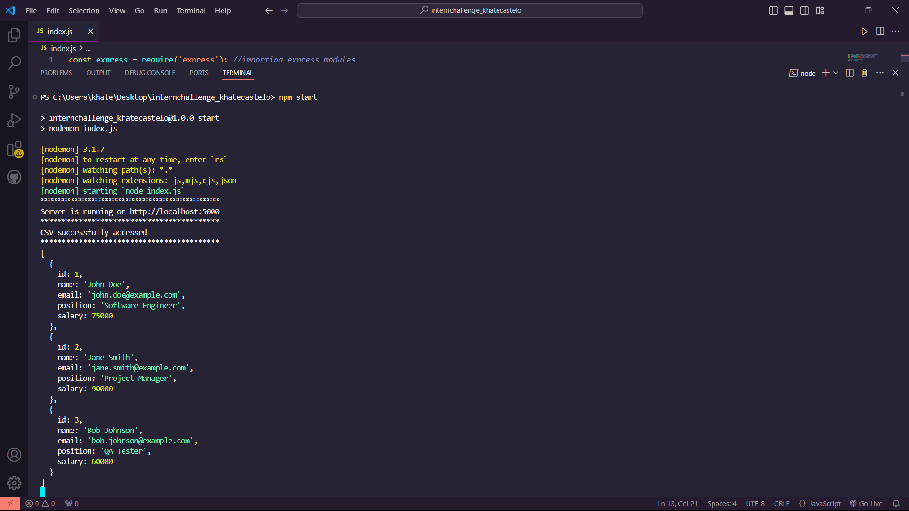

# Simple CSV Reader and CRUD API with Node.js
Coding challenge.  
Getting familiar with working with Node.js, Express, and handling file operations.  
Fulfilled requirements from 1 to 4.  
Using VSCode. 

### About
Created a JavaScript progam using Express and Node.js where it can read CSV files, and retrieve data of employees. Implemented a GET request to retrieve employee details based on their id. 

- `internchallenge_khatecastelo`: the folder containing all my files.
-  `images`: containing screenshots of my testing and server working.
- `index.js`: my js file for running.
- `data.csv`: my sample CSV file.

### To run program 
`npm start` to run the program.

  

   
  

### Testing (curl commands)
For testing my endpoints, I used curl commands to see whether the following works: 

1.  `curl http://localhost:5000/employees` - accessing employee data.
2.  `curl http://localhost:5000/employees/1` - GET employee details of id 3.
3.  `curl http://localhost:5000/employees/10` - error handling of GET request.
4.   `curl http://localhost:5000` - accessing server via port.

### References
A lot of researching and reviewing. 
[Freecodecamp](https://www.freecodecamp.org/news/create-crud-api-project/)  
[w3schools](https://www.w3schools.com/nodejs/)
